# Frontend Integration Plan - Enerbook Payment Flows

## Overview

This document outlines the complete frontend development roadmap for integrating the React Native application with the n8n payment workflows. All backend workflows (W1-W5) are tested and operational.

---

## 1. API Endpoints Summary

### Production n8n Webhooks

| Workflow | Endpoint | Method | Purpose | Called By |
|----------|----------|--------|---------|-----------|
| W1 | `https://services.enerbook.mx/webhook/payment-upfront` | POST | Create upfront payment | Cliente App |
| W2 | `https://services.enerbook.mx/webhook/stripe-events` | POST | Handle Stripe webhooks | Stripe |
| W3 | `https://services.enerbook.mx/webhook/payment-milestones-setup` | POST | Setup milestone payment plan | Cliente App |
| W4 | `https://services.enerbook.mx/webhook/milestone-complete` | POST | Mark milestone complete | Instalador App |
| W5 | `https://services.enerbook.mx/webhook/milestone-pay` | POST | Generate payment for milestone | Cliente App |

### Supabase Edge Functions

| Function | Endpoint | Method | Purpose | Status |
|----------|----------|--------|---------|--------|
| insert_payment_record | `/functions/v1/insert_payment_record` | POST | Legacy payment creation | ✅ Exists |
| *stripe_connect_onboard* | `/functions/v1/stripe_connect_onboard` | POST | Create Connect account for installer | ❌ **NEEDS CREATION** |

---

## 2. Required Frontend Components

### Cliente (Client) Components

#### 2.1 Payment Method Selection Screen
**File**: `app/cliente/proyecto/[id]/payment-method.jsx`

**Purpose**: Let cliente choose between upfront or milestone payment

**UI Elements**:
- Radio buttons: "Pago Completo" / "Pago por Hitos"
- If milestones selected: Dropdown to choose template
- Amount display with breakdown (platform fee 8%, installer 92%)
- "Continuar" button

**API Calls**:
```javascript
// Fetch available milestone templates
const { data: templates } = await supabase
  .from('installer_milestone_templates')
  .select('*')
  .eq('instalador_id', proyecto.instalador_id)
```

---

#### 2.2 Upfront Payment Screen
**File**: `app/cliente/proyecto/[id]/payment-upfront.jsx`

**Purpose**: Process full upfront payment

**UI Elements**:
- Amount summary
- Stripe Payment Sheet (React Native)
- Payment status indicator

**API Flow**:
```javascript
// 1. Call W1 to create PaymentIntent
const response = await fetch('https://services.enerbook.mx/webhook/payment-upfront', {
  method: 'POST',
  headers: { 'Content-Type': 'application/json' },
  body: JSON.stringify({
    proyecto_id: proyecto.id,
    cliente_id: user.id,
    instalador_id: proyecto.instalador_id,
    total_amount: proyecto.costo_total,
    payment_method: 'upfront'
  })
});

const { client_secret } = await response.json();

// 2. Initialize Stripe Payment Sheet
import { useStripe } from '@stripe/stripe-react-native';
const { initPaymentSheet, presentPaymentSheet } = useStripe();

await initPaymentSheet({
  paymentIntentClientSecret: client_secret,
  merchantDisplayName: 'Enerbook',
});

// 3. Present payment sheet
const { error } = await presentPaymentSheet();

// 4. Poll payment status or listen to Supabase realtime
const subscription = supabase
  .channel('payment-updates')
  .on('postgres_changes', {
    event: 'UPDATE',
    schema: 'public',
    table: 'payments',
    filter: `proyecto_id=eq.${proyecto.id}`
  }, (payload) => {
    if (payload.new.status === 'completed') {
      // Navigate to success screen
    }
  })
  .subscribe();
```

---

#### 2.3 Milestone Setup Screen
**File**: `app/cliente/proyecto/[id]/payment-milestones.jsx`

**Purpose**: Configure milestone payment plan

**UI Elements**:
- Template selector dropdown
- Preview of milestone breakdown (table):
  - Milestone #, Title, Description, Percentage, Amount
- Total amount display
- "Confirmar Plan de Hitos" button

**API Flow**:
```javascript
// Call W3 to setup milestone plan
const response = await fetch('https://services.enerbook.mx/webhook/payment-milestones-setup', {
  method: 'POST',
  headers: { 'Content-Type': 'application/json' },
  body: JSON.stringify({
    proyecto_id: proyecto.id,
    cliente_id: user.id,
    instalador_id: proyecto.instalador_id,
    template_id: selectedTemplate.id,
    total_amount: proyecto.costo_total
  })
});

const result = await response.json();
// result.success, result.payment_id, result.milestones_created

// Navigate to milestone tracking screen
```

---

#### 2.4 Milestone Tracking Screen
**File**: `app/cliente/proyecto/[id]/milestones.jsx`

**Purpose**: View and pay individual milestones

**UI Elements**:
- List of milestones with status badges:
  - 🟡 Pending (gray, not yet completable by installer)
  - 🔵 In Progress (blue, installer marked complete, awaiting payment)
  - 🟢 Completed (green, physical work done but unpaid)
  - ✅ Paid (success green)
- For completed milestones: "Pagar Hito" button
- Progress bar showing overall payment completion

**API Flow**:
```javascript
// Fetch milestones for proyecto
const { data: payment } = await supabase
  .from('payments')
  .select('*, payment_milestones(*)')
  .eq('proyecto_id', proyecto.id)
  .eq('payment_method', 'milestones')
  .single();

// When cliente clicks "Pagar Hito" on completed milestone
const payMilestone = async (milestoneId) => {
  // 1. Call W5 to create PaymentIntent
  const response = await fetch('https://services.enerbook.mx/webhook/milestone-pay', {
    method: 'POST',
    headers: { 'Content-Type': 'application/json' },
    body: JSON.stringify({
      milestone_id: milestoneId
    })
  });

  const { client_secret, amount } = await response.json();

  // 2. Show Stripe Payment Sheet
  await initPaymentSheet({
    paymentIntentClientSecret: client_secret,
    merchantDisplayName: 'Enerbook',
  });

  const { error } = await presentPaymentSheet();

  // 3. Listen for status update via Supabase realtime
  // (W2 will update milestone to 'paid' after payment succeeds)
};
```

**Supabase Realtime**:
```javascript
// Subscribe to milestone updates
const subscription = supabase
  .channel('milestone-updates')
  .on('postgres_changes', {
    event: 'UPDATE',
    schema: 'public',
    table: 'payment_milestones',
    filter: `payment_id=eq.${payment.id}`
  }, (payload) => {
    // Update UI when milestone status changes
    setMilestones(prev => prev.map(m =>
      m.id === payload.new.id ? payload.new : m
    ));
  })
  .subscribe();
```

---

### Instalador (Installer) Components

#### 2.5 Milestone Management Screen
**File**: `app/instalador/proyecto/[id]/milestones.jsx`

**Purpose**: Mark physical milestones as completed

**UI Elements**:
- List of milestones for proyecto
- Status indicator (pending, in_progress, completed, paid)
- For pending milestones: "Marcar como Completado" button
- Upload photos/documentation (future enhancement)

**API Flow**:
```javascript
// Fetch milestones
const { data: payment } = await supabase
  .from('payments')
  .select('*, payment_milestones(*)')
  .eq('proyecto_id', proyecto.id)
  .eq('payment_method', 'milestones')
  .single();

// Mark milestone complete
const completeMilestone = async (milestoneId) => {
  const response = await fetch('https://services.enerbook.mx/webhook/milestone-complete', {
    method: 'POST',
    headers: { 'Content-Type': 'application/json' },
    body: JSON.stringify({
      milestone_id: milestoneId
    })
  });

  const result = await response.json();
  // result.success = true

  // Refresh milestones list
};
```

---

#### 2.6 Stripe Connect Onboarding Screen
**File**: `app/instalador/onboarding/stripe-connect.jsx`

**Purpose**: Setup Stripe Connect account for receiving payments

**Status**: ❌ **REQUIRES NEW EDGE FUNCTION**

**UI Elements**:
- Explanation text: "Para recibir pagos, necesitas conectar tu cuenta bancaria"
- "Conectar con Stripe" button
- Status indicator (connected/not connected)

**Required Edge Function**:
```typescript
// supabase/functions/stripe_connect_onboard/index.ts
import Stripe from 'stripe';

serve(async (req) => {
  const stripe = new Stripe(Deno.env.get('STRIPE_SECRET_KEY'));
  const { instalador_id, email, phone } = await req.json();

  // Create Connect account
  const account = await stripe.accounts.create({
    type: 'standard',
    country: 'MX',
    email: email,
    capabilities: {
      card_payments: { requested: true },
      transfers: { requested: true },
    },
    business_type: 'individual',
  });

  // Update proveedor with stripe_account_id
  await supabase
    .from('proveedores')
    .update({ stripe_account_id: account.id })
    .eq('id', instalador_id);

  // Create account link for onboarding
  const accountLink = await stripe.accountLinks.create({
    account: account.id,
    refresh_url: 'enerbook://stripe-refresh',
    return_url: 'enerbook://stripe-success',
    type: 'account_onboarding',
  });

  return { url: accountLink.url };
});
```

**Frontend Flow**:
```javascript
import * as WebBrowser from 'expo-web-browser';

const startStripeOnboarding = async () => {
  const response = await fetch(
    `${SUPABASE_URL}/functions/v1/stripe_connect_onboard`,
    {
      method: 'POST',
      headers: {
        'Content-Type': 'application/json',
        'Authorization': `Bearer ${session.access_token}`
      },
      body: JSON.stringify({
        instalador_id: user.id,
        email: user.email,
        phone: user.phone
      })
    }
  );

  const { url } = await response.json();

  // Open Stripe onboarding in browser
  await WebBrowser.openBrowserAsync(url);
};
```

---

## 3. Stripe Integration Setup

### 3.1 Install Dependencies

Already installed in project:
```json
"@stripe/stripe-react-native": "^0.50.3"
```

### 3.2 Initialize Stripe Provider

**File**: `app/_layout.jsx`

```javascript
import { StripeProvider } from '@stripe/stripe-react-native';

export default function RootLayout() {
  return (
    <StripeProvider
      publishableKey={process.env.EXPO_PUBLIC_STRIPE_PUBLISHABLE_KEY}
      merchantIdentifier="merchant.mx.enerbook"
    >
      {/* existing layout */}
    </StripeProvider>
  );
}
```

### 3.3 Payment Sheet Hook

**File**: `src/hooks/usePaymentSheet.js`

```javascript
import { useStripe } from '@stripe/stripe-react-native';
import { useState } from 'react';

export const usePaymentSheet = () => {
  const { initPaymentSheet, presentPaymentSheet } = useStripe();
  const [loading, setLoading] = useState(false);

  const processPayment = async (clientSecret) => {
    setLoading(true);

    try {
      // 1. Initialize the sheet
      const { error: initError } = await initPaymentSheet({
        paymentIntentClientSecret: clientSecret,
        merchantDisplayName: 'Enerbook',
        style: 'automatic',
        returnURL: 'enerbook://payment-complete',
      });

      if (initError) {
        throw new Error(initError.message);
      }

      // 2. Present the sheet
      const { error: presentError } = await presentPaymentSheet();

      if (presentError) {
        if (presentError.code === 'Canceled') {
          return { canceled: true };
        }
        throw new Error(presentError.message);
      }

      return { success: true };
    } catch (error) {
      return { error: error.message };
    } finally {
      setLoading(false);
    }
  };

  return { processPayment, loading };
};
```

---

## 4. State Management

### 4.1 Payment Context

**File**: `src/context/PaymentContext.jsx`

```javascript
import { createContext, useContext, useState, useEffect } from 'react';
import { supabase } from '../lib/supabase';

const PaymentContext = createContext();

export const PaymentProvider = ({ children }) => {
  const [payments, setPayments] = useState([]);
  const [loading, setLoading] = useState(false);

  const fetchPayments = async (userId, userType) => {
    setLoading(true);
    try {
      const query = supabase
        .from('payments')
        .select('*, payment_milestones(*), proyectos(*)')
        .order('created_at', { ascending: false });

      if (userType === 'cliente') {
        query.eq('cliente_id', userId);
      } else if (userType === 'instalador') {
        query.eq('instalador_id', userId);
      }

      const { data, error } = await query;
      if (error) throw error;
      setPayments(data);
    } finally {
      setLoading(false);
    }
  };

  const subscribeToPaymentUpdates = (paymentId) => {
    const subscription = supabase
      .channel(`payment-${paymentId}`)
      .on('postgres_changes', {
        event: 'UPDATE',
        schema: 'public',
        table: 'payments',
        filter: `id=eq.${paymentId}`
      }, (payload) => {
        setPayments(prev => prev.map(p =>
          p.id === payload.new.id ? { ...p, ...payload.new } : p
        ));
      })
      .on('postgres_changes', {
        event: 'UPDATE',
        schema: 'public',
        table: 'payment_milestones',
        filter: `payment_id=eq.${paymentId}`
      }, (payload) => {
        setPayments(prev => prev.map(p => {
          if (p.id === paymentId) {
            return {
              ...p,
              payment_milestones: p.payment_milestones.map(m =>
                m.id === payload.new.id ? payload.new : m
              )
            };
          }
          return p;
        }));
      })
      .subscribe();

    return () => subscription.unsubscribe();
  };

  return (
    <PaymentContext.Provider value={{
      payments,
      loading,
      fetchPayments,
      subscribeToPaymentUpdates
    }}>
      {children}
    </PaymentContext.Provider>
  );
};

export const usePayment = () => useContext(PaymentContext);
```

---

## 5. User Flows - Detailed Steps

### Flow 1: Cliente - Upfront Payment


**Frontend Steps**:
1. Cliente views proyecto details
2. Clicks "Proceder al Pago"
3. Selects "Pago Completo"
4. App calls W1 with proyecto data
5. App receives client_secret
6. App shows Stripe Payment Sheet
7. Cliente enters card and confirms
8. App subscribes to payment status via Supabase realtime
9. W2 updates payment to "completed" (triggered by Stripe)
10. App shows success screen and confetti animation

---

### Flow 2: Cliente - Milestone Setup


**Frontend Steps**:
1. Cliente views proyecto details
2. Clicks "Proceder al Pago"
3. Selects "Pago por Hitos"
4. App fetches available templates from Supabase
5. Cliente chooses template (e.g., "3 Hitos Estándar")
6. App shows preview of milestone breakdown
7. Cliente confirms
8. App calls W3 to setup milestone plan
9. W3 creates 1 payment record + N milestone records
10. App navigates to milestone tracking screen

---

### Flow 3: Instalador - Mark Milestone Complete


**Frontend Steps**:
1. Instalador views proyecto in dashboard
2. Navigates to "Hitos" tab
3. Sees list of milestones with status
4. For pending milestone, clicks "Marcar como Completado"
5. App shows confirmation: "¿Confirmas que completaste: [milestone title]?"
6. Instalador confirms
7. App calls W4
8. W4 updates milestone to "completed"
9. App refreshes milestone list
10. (Future) Cliente receives push notification

---

### Flow 4: Cliente - Pay Individual Milestone


**Frontend Steps**:
1. Cliente views proyecto milestone tracking
2. Sees milestone with status "completed" (green badge)
3. Clicks "Pagar Hito #1"
4. App calls W5 with milestone_id
5. App receives client_secret
6. App shows Stripe Payment Sheet with milestone amount
7. Cliente enters card and confirms
8. App subscribes to milestone updates
9. W2 updates milestone to "paid" (triggered by Stripe)
10. App shows success animation
11. App updates progress bar (e.g., 1/3 milestones paid)

---

### Flow 5: Instalador - Stripe Connect Onboarding

```mermaid
sequenceDiagram
    Instalador->>App: Sign up as installer
    App->>Supabase: Create proveedor record
    Supabase-->>App: Return proveedor_id
    App->>App: Show "Conectar Stripe" screen
    Instalador->>App: Click "Conectar con Stripe"
    App->>EdgeFunction: POST /stripe_connect_onboard
    EdgeFunction->>Stripe: Create Connect account
    Stripe-->>EdgeFunction: Return account.id
    EdgeFunction->>Supabase: Update proveedor.stripe_account_id
    EdgeFunction->>Stripe: Create AccountLink
    Stripe-->>EdgeFunction: Return onboarding URL
    EdgeFunction-->>App: Return URL
    App->>WebBrowser: Open Stripe onboarding
    Instalador->>Stripe: Complete onboarding forms
    Stripe-->>App: Redirect to return_url
    App->>Stripe: Retrieve account status
    App->>Instalador: Show "Cuenta conectada ✅"
```



**Frontend Steps**:
1. New instalador completes signup
2. App checks if `proveedor.stripe_account_id` exists
3. If not, shows "Conectar Stripe" screen with explanation
4. Instalador clicks "Conectar con Stripe"
5. App calls Edge Function `/stripe_connect_onboard`
6. Edge Function creates Stripe Connect account
7. Edge Function returns onboarding URL
8. App opens URL in WebBrowser (Expo)
9. Instalador completes Stripe forms (bank details, identity verification)
10. Stripe redirects back to app
11. App verifies account is active
12. App shows success screen

---

## 6. API Integration Code Examples

### Example 1: Call W1 (Upfront Payment)

```javascript
// src/api/payments.js
export const createUpfrontPayment = async (proyectoData) => {
  const response = await fetch('https://services.enerbook.mx/webhook/payment-upfront', {
    method: 'POST',
    headers: {
      'Content-Type': 'application/json',
    },
    body: JSON.stringify({
      proyecto_id: proyectoData.id,
      cliente_id: proyectoData.cliente_id,
      instalador_id: proyectoData.instalador_id,
      total_amount: proyectoData.costo_total,
      payment_method: 'upfront'
    })
  });

  if (!response.ok) {
    const error = await response.json();
    throw new Error(error.error || 'Payment creation failed');
  }

  return response.json(); // { client_secret, payment_id }
};
```

---

### Example 2: Call W3 (Milestone Setup)

```javascript
export const setupMilestones = async (proyectoData, templateId) => {
  const response = await fetch('https://services.enerbook.mx/webhook/payment-milestones-setup', {
    method: 'POST',
    headers: {
      'Content-Type': 'application/json',
    },
    body: JSON.stringify({
      proyecto_id: proyectoData.id,
      cliente_id: proyectoData.cliente_id,
      instalador_id: proyectoData.instalador_id,
      template_id: templateId,
      total_amount: proyectoData.costo_total
    })
  });

  if (!response.ok) {
    throw new Error('Milestone setup failed');
  }

  return response.json(); // { success, payment_id, milestones_created, total_amount }
};
```

---

### Example 3: Call W4 (Mark Complete)

```javascript
export const completeMilestone = async (milestoneId) => {
  const response = await fetch('https://services.enerbook.mx/webhook/milestone-complete', {
    method: 'POST',
    headers: {
      'Content-Type': 'application/json',
    },
    body: JSON.stringify({
      milestone_id: milestoneId
    })
  });

  if (!response.ok) {
    throw new Error('Failed to mark milestone complete');
  }

  return response.json(); // { success, milestone_id, status: "completed" }
};
```

---

### Example 4: Call W5 (Pay Milestone)

```javascript
export const payMilestone = async (milestoneId) => {
  const response = await fetch('https://services.enerbook.mx/webhook/milestone-pay', {
    method: 'POST',
    headers: {
      'Content-Type': 'application/json',
    },
    body: JSON.stringify({
      milestone_id: milestoneId
    })
  });

  if (!response.ok) {
    const error = await response.json();
    throw new Error(error.error || 'Payment creation failed');
  }

  return response.json(); // { client_secret, payment_id, amount }
};
```

---

### Example 5: Supabase Realtime Subscription

```javascript
// src/hooks/usePaymentUpdates.js
import { useEffect } from 'react';
import { supabase } from '../lib/supabase';

export const usePaymentUpdates = (paymentId, onUpdate) => {
  useEffect(() => {
    if (!paymentId) return;

    const subscription = supabase
      .channel(`payment-updates-${paymentId}`)
      .on('postgres_changes', {
        event: 'UPDATE',
        schema: 'public',
        table: 'payments',
        filter: `id=eq.${paymentId}`
      }, (payload) => {
        console.log('Payment updated:', payload.new);
        onUpdate('payment', payload.new);
      })
      .on('postgres_changes', {
        event: 'UPDATE',
        schema: 'public',
        table: 'payment_milestones',
        filter: `payment_id=eq.${paymentId}`
      }, (payload) => {
        console.log('Milestone updated:', payload.new);
        onUpdate('milestone', payload.new);
      })
      .subscribe();

    return () => {
      subscription.unsubscribe();
    };
  }, [paymentId, onUpdate]);
};
```

---

## 7. Testing Checklist

### Unit Testing

- [ ] Test W1 API call with valid data
- [ ] Test W1 API call with invalid data (missing fields)
- [ ] Test W3 API call with valid template_id
- [ ] Test W3 API call with invalid template_id
- [ ] Test W4 API call with valid milestone_id
- [ ] Test W4 API call with already completed milestone
- [ ] Test W5 API call with completed milestone
- [ ] Test W5 API call with pending milestone (should fail)

### Integration Testing

#### Upfront Payment Flow
- [ ] Create proyecto with upfront payment
- [ ] Call W1 and verify client_secret returned
- [ ] Initialize Stripe Payment Sheet
- [ ] Use test card `4242 4242 4242 4242`
- [ ] Verify payment completes in Stripe dashboard
- [ ] Verify W2 webhook received by n8n
- [ ] Verify payment status updated to "completed" in Supabase
- [ ] Verify proyecto.payment_status updated to "paid"

#### Milestone Setup Flow
- [ ] Create proyecto
- [ ] Create milestone template with 3 milestones
- [ ] Call W3 with template_id
- [ ] Verify 1 payment record created
- [ ] Verify 3 milestone records created with correct amounts
- [ ] Verify amounts sum to total_amount
- [ ] Verify platform_fee = 8% of total

#### Milestone Completion Flow
- [ ] Setup milestone payment plan
- [ ] As instalador, call W4 for first milestone
- [ ] Verify milestone.status = "completed"
- [ ] Verify milestone.completed_at is set
- [ ] Verify cliente sees updated status in app

#### Milestone Payment Flow
- [ ] Mark milestone as completed (W4)
- [ ] As cliente, call W5 for completed milestone
- [ ] Verify client_secret returned
- [ ] Complete payment with test card
- [ ] Verify W2 receives payment_intent.succeeded
- [ ] Verify milestone.status = "paid"
- [ ] Verify milestone.stripe_payment_intent_id is set
- [ ] Verify next milestone becomes available

#### Stripe Connect Flow
- [ ] Create new instalador account
- [ ] Call `/stripe_connect_onboard` Edge Function
- [ ] Verify Stripe Connect account created
- [ ] Verify proveedor.stripe_account_id updated
- [ ] Open onboarding URL in WebBrowser
- [ ] Complete Stripe forms
- [ ] Verify account status = "active"
- [ ] Test split payment reaches Connect account

### End-to-End Testing

- [ ] Complete full upfront payment flow (cliente perspective)
- [ ] Complete full milestone flow (cliente + instalador)
- [ ] Test with 10,000 MXN payment
- [ ] Test with 500,000 MXN payment
- [ ] Test payment failure scenario
- [ ] Test network interruption during payment
- [ ] Test app backgrounding during payment
- [ ] Verify realtime updates work on multiple devices

---

## 8. Production Deployment Checklist

### Stripe Configuration

- [ ] **Configure Stripe webhook in dashboard**
  - URL: `https://services.enerbook.mx/webhook/stripe-events`
  - Events to listen to:
    - `payment_intent.succeeded`
    - `payment_intent.payment_failed`
    - `transfer.created`
  - Copy webhook signing secret to `.env` as `STRIPE_WEBHOOK_SECRET`

- [ ] **Verify Stripe API keys**
  - Test mode: Already configured
  - Production mode: Update when ready to go live
  - Set `EXPO_PUBLIC_STRIPE_PUBLISHABLE_KEY` (prod key)
  - Set `STRIPE_SECRET_KEY` (prod key in n8n)

- [ ] **Configure Stripe Connect settings**
  - Platform name: "Enerbook"
  - Business type: Marketplace
  - Platform fee: 8%
  - Countries: Mexico (MX)

### n8n Workflows

- [ ] **Activate all workflows in production n8n**
  - W1: Upfront Payment Processing
  - W2: Stripe Webhook Handler
  - W3: Milestone Setup
  - W4: Milestone Complete
  - W5: Milestone Payment

- [ ] **Verify webhook URLs are accessible**
  - Test each endpoint with curl
  - Verify SSL certificates are valid
  - Check response times (<2s preferred)

### Supabase Configuration

- [ ] **Enable Realtime for tables**
  - `payments`
  - `payment_milestones`
  - `proyectos`

- [ ] **Create database indexes for performance**
  ```sql
  CREATE INDEX idx_payments_proyecto_id ON payments(proyecto_id);
  CREATE INDEX idx_payments_cliente_id ON payments(cliente_id);
  CREATE INDEX idx_payments_instalador_id ON payments(instalador_id);
  CREATE INDEX idx_milestones_payment_id ON payment_milestones(payment_id);
  CREATE INDEX idx_milestones_status ON payment_milestones(status);
  ```

- [ ] **Deploy Edge Function: stripe_connect_onboard**
  ```bash
  supabase functions deploy stripe_connect_onboard
  ```

- [ ] **Set environment variables for Edge Functions**
  ```bash
  supabase secrets set STRIPE_SECRET_KEY=sk_live_...
  supabase secrets set SUPABASE_SERVICE_ROLE_KEY=eyJ...
  ```

### Frontend App

- [ ] **Update environment variables**
  - Production Supabase URL
  - Production Supabase anon key
  - Production Stripe publishable key
  - n8n webhook base URL

- [ ] **Configure deep linking**
  - iOS: Update `ios/enerbook/Info.plist` with URL schemes
  - Android: Update `android/app/src/main/AndroidManifest.xml`
  - Test return URLs: `enerbook://payment-complete`, `enerbook://stripe-success`

- [ ] **Build and submit to app stores**
  ```bash
  # Build for iOS
  eas build --platform ios --profile production

  # Build for Android
  eas build --platform android --profile production
  ```

### Monitoring & Logging

- [ ] **Setup error tracking** (Sentry, Bugsnag, etc.)
- [ ] **Configure n8n error notifications** (Slack, email)
- [ ] **Monitor Stripe webhook delivery** (retry failures)
- [ ] **Setup Supabase database alerts** (high error rates)

---

## 9. Security Considerations

### API Security

**Webhook Signature Verification**:
- W2 already validates Stripe webhook signatures
- All other webhooks (W1, W3, W4, W5) are currently **unprotected**
- **RECOMMENDED**: Add API key or JWT authentication

**Example: Add Bearer token to n8n webhooks**:
```javascript
// In app, add Authorization header
const response = await fetch('https://services.enerbook.mx/webhook/payment-upfront', {
  method: 'POST',
  headers: {
    'Content-Type': 'application/json',
    'Authorization': `Bearer ${process.env.N8N_API_KEY}` // Set in .env
  },
  body: JSON.stringify(data)
});
```

**n8n webhook node configuration**:
- Add "Function" node before webhook response to validate:
```javascript
const authHeader = $('Webhook').first().json.headers.authorization;
const expectedToken = 'Bearer ' + $env.N8N_API_KEY;

if (authHeader !== expectedToken) {
  throw new Error('Unauthorized');
}

return [$input.all()];
```

### Data Validation

- [ ] Validate all user inputs before API calls
- [ ] Sanitize proyecto_id, cliente_id, instalador_id (UUID format)
- [ ] Validate amounts are positive numbers
- [ ] Verify user has permission to pay proyecto (cliente owns it)
- [ ] Verify instalador can only mark their own milestones complete

### PCI Compliance

- ✅ **Never store card numbers** (Stripe handles this)
- ✅ **Never log payment details**
- ✅ **Use HTTPS for all API calls**
- ✅ **Stripe Payment Sheet handles card input** (PCI compliant)

### Supabase RLS Policies

**Example policies to add**:

```sql
-- Clientes can only view their own payments
CREATE POLICY "Clientes view own payments"
ON payments FOR SELECT
USING (auth.uid() = cliente_id);

-- Instaladores can view payments for their proyectos
CREATE POLICY "Instaladores view payments"
ON payments FOR SELECT
USING (auth.uid() = instalador_id);

-- Only instaladores can mark milestones complete
CREATE POLICY "Instaladores complete milestones"
ON payment_milestones FOR UPDATE
USING (
  auth.uid() = (SELECT instalador_id FROM payments WHERE id = payment_id)
);
```

---

## 10. Environment Variables Summary

### Frontend (`.env`)
```bash
EXPO_PUBLIC_SUPABASE_URL=https://qkdvosjitrkopnarbozv.supabase.co
EXPO_PUBLIC_SUPABASE_ANON_KEY=eyJ...
EXPO_PUBLIC_STRIPE_PUBLISHABLE_KEY=pk_test_51S... # Use pk_live_... in prod
N8N_WEBHOOK_BASE_URL=https://services.enerbook.mx
N8N_API_KEY=your-secure-api-key-here # For webhook authentication
```

### n8n Workflows (Credentials)
- Stripe API Key (already configured)
- Supabase API Key (service role - already in workflows)

### Supabase Edge Functions (Secrets)
```bash
STRIPE_SECRET_KEY=sk_test_... # Use sk_live_... in prod
SUPABASE_URL=https://qkdvosjitrkopnarbozv.supabase.co
SUPABASE_SERVICE_ROLE_KEY=eyJ...
```

---

## 11. Next Steps - Development Priority

### Phase 1: Core Payment Infrastructure (Week 1-2)
1. ✅ Create Stripe Connect onboarding Edge Function
2. ✅ Build PaymentContext and usePaymentSheet hook
3. ✅ Implement upfront payment screen (cliente)
4. ✅ Test end-to-end upfront payment flow

### Phase 2: Milestone Payments (Week 3-4)
5. ✅ Build milestone setup screen (cliente)
6. ✅ Build milestone tracking screen (cliente)
7. ✅ Build milestone management screen (instalador)
8. ✅ Implement milestone payment flow
9. ✅ Add Supabase realtime subscriptions

### Phase 3: Instalador Onboarding (Week 5)
10. ✅ Build Stripe Connect onboarding screen
11. ✅ Test Stripe Connect account creation
12. ✅ Verify split payments work correctly

### Phase 4: Polish & Testing (Week 6)
13. ✅ Add loading states and error handling
14. ✅ Implement success animations
15. ✅ Add push notifications for payment events
16. ✅ Complete integration testing checklist

### Phase 5: Security & Production (Week 7)
17. ✅ Add webhook authentication
18. ✅ Implement RLS policies
19. ✅ Configure production Stripe webhooks
20. ✅ Deploy Edge Functions
21. ✅ Activate n8n workflows in production

---

## 12. Support & Documentation

### n8n Workflows
- Location: `.estructura_lógica/.n8n/n8n-stripe-workflows/`
- Documentation: `N8N_WORKFLOWS_SETUP.md`
- Access: https://services.enerbook.mx/webhook/

### Stripe Resources
- Dashboard: https://dashboard.stripe.com/
- API Docs: https://stripe.com/docs/api
- Connect Docs: https://stripe.com/docs/connect
- Test Cards: https://stripe.com/docs/testing

### Supabase Resources
- Dashboard: https://supabase.com/dashboard/project/qkdvosjitrkopnarbozv
- Realtime Docs: https://supabase.com/docs/guides/realtime
- Edge Functions: https://supabase.com/docs/guides/functions

---

## 13. Common Issues & Troubleshooting

### Issue: "No such destination" error in W5
**Cause**: Instalador doesn't have valid Stripe Connect account
**Fix**: Complete Stripe Connect onboarding before accepting payments

### Issue: Payment shows "pending" forever
**Cause**: W2 webhook not receiving events from Stripe
**Fix**: Verify webhook URL in Stripe dashboard, check webhook signing secret

### Issue: Milestone can't be paid
**Cause**: Milestone status is not "completed"
**Fix**: Instalador must mark milestone complete (W4) before cliente can pay

### Issue: Realtime updates not working
**Cause**: Supabase Realtime not enabled for table
**Fix**: Enable Realtime in Supabase dashboard → Database → Replication

### Issue: Amount too large error
**Cause**: Test mode has $999,999.99 USD limit
**Fix**: Use smaller amounts for testing, or switch to live mode

---

## Conclusion

This plan covers all aspects of integrating the frontend React Native app with the n8n payment workflows. All backend workflows (W1-W5) are tested and operational. The main development work ahead is:

1. **Create Stripe Connect onboarding Edge Function**
2. **Build payment UI screens** (6 new screens)
3. **Implement Stripe Payment Sheet** integration
4. **Setup Supabase Realtime** subscriptions
5. **Add security** (webhook auth, RLS policies)
6. **Test end-to-end flows**
7. **Deploy to production**

Estimated development time: **6-7 weeks** for a single full-stack developer.

---

**Document Version**: 1.0
**Last Updated**: 2025-10-20
**Author**: Claude (Enerbook Payment Integration)